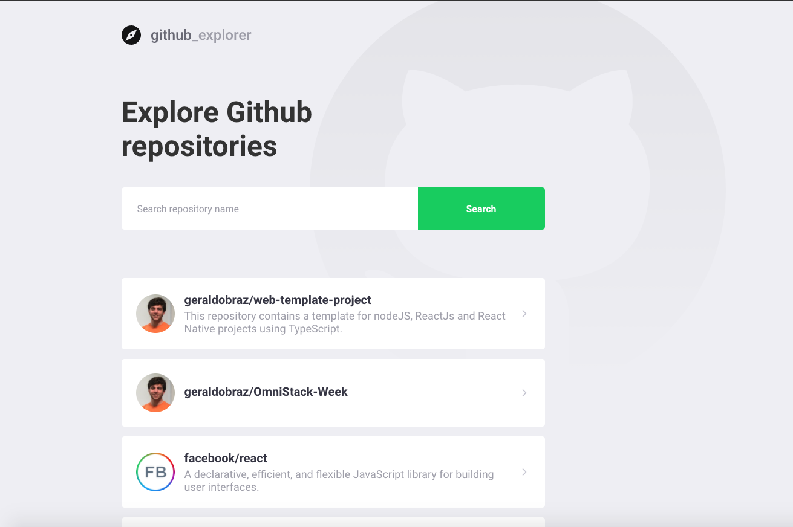
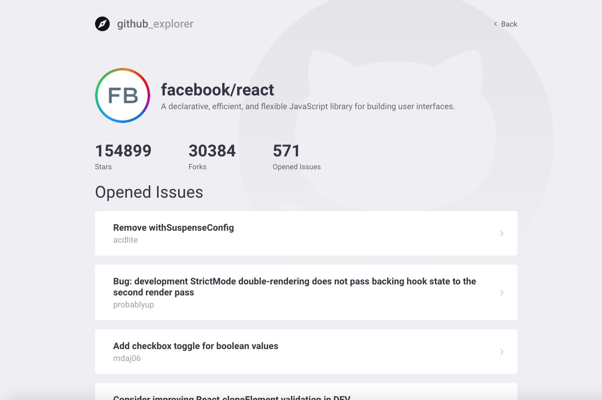

<h1 align="center"></h1>

<div align="center">

   
</div>

*This repository is for learning purpose. It has a simple reactJS application that helps people find github repositories using the github API.*

<p align="center" style="margin-top: 30px;">
    
</p>

## 🚀 Getting Started
Go to the frontend folder and run the following commands to start the web application
### 📥 Installing dependencies

Inside de project's folder, run:

```
yarn
```

### 🏎 Running application
```
yarn start
```

### Screens
<p align="center">
    
    <br/>
    <br/>
    
</p>

## 🛠 Built With

* [ReactJs](https://reactjs.org/) - A declarative, efficient, and flexible JavaScript library for building user interfaces.
* [Yarn](https://yarnpkg.com/) - Package Manager
* [TypeScript](https://www.typescriptlang.org/) - Typed Superset of JavaScript - used as a development dependency

<br/>

## 🎖 Author
* **Geraldo Braz** - *Initial work* - [@geraldobraz](https://github.com/geraldobraz)

<div align="center">
  <sub>This project was developed during the GoStack course by
  <a href="https://rocketseat.com.br/">Rocketseat</a>
</div>
